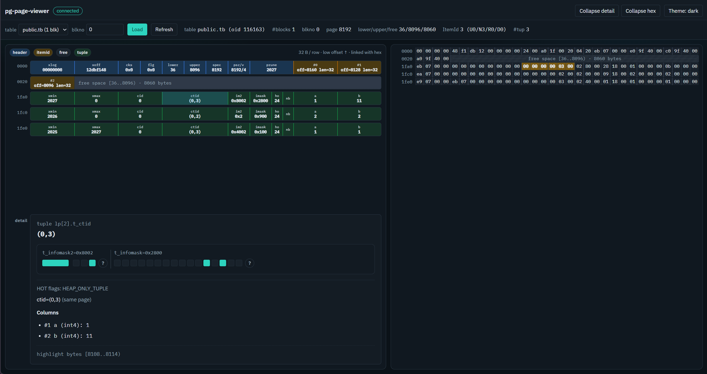

# pg-page-viewer

English | [中文](./README.zh-CN.md)

Browse PostgreSQL heap pages and WAL records in the browser. Connect locally, fetch raw blocks via [`pageinspect`](https://www.postgresql.org/docs/current/pageinspect.html), or browse structured WAL records via [`pg_walinspect`](https://www.postgresql.org/docs/current/pgwalinspect.html) (PostgreSQL 15+).

Built for developers learning or debugging — **not** intended for public deployment.



## Features

### Page mode

- **Structure diagram** — 32 bytes/row: page header, ItemId array, free space, tuples
- **Hex dump** — same 32B/row layout, linked selection and scroll-to-offset
- **Tuple decode** — column values, `t_infomask` / `t_infomask2` bit strips, HOT/ctid hints
- **Diff highlight** — byte-level changes on Refresh

### WAL mode

- Chrome switch **Page | WAL**; independent list UI (one wide metadata row per record)
- Query by start/end LSN; optional “Fill current LSN” (does not auto-load)
- FPI rows default collapsed (length/metadata only; no raw 8KB page render)
- **v1 has no WAL raw-byte hex** — structured `pg_walinspect` fields only
- Hard batch limits (fail, never truncate): ≤2000 records, ≤2 MiB JSON, ≤16 MiB LSN span

### Shared

- **Light / dark** theme

## Requirements

- Node.js 20+, pnpm 9+
- **Page mode:** PostgreSQL with `pageinspect` enabled; a role that can call `get_raw_page` (often superuser)
- **WAL mode:** PostgreSQL **15+** with `pg_walinspect` enabled; a role that can call `pg_get_wal_records_info` / `pg_current_wal_lsn` (often superuser)

```sql
CREATE EXTENSION pageinspect;      -- Page mode
CREATE EXTENSION pg_walinspect;    -- WAL mode (PG15+)
```

The app never runs `CREATE EXTENSION` for you. Connect succeeds without either extension; each mode fails clearly when its extension (or PG version for WAL) is missing.

## Quick start

```bash
pnpm install
cp .env.example .env   # optional: auto-connect on server start
pnpm dev:server        # http://127.0.0.1:8787
pnpm dev:web           # http://127.0.0.1:5173
```

Open the web UI, connect (or rely on `.env`), then use **Page** (table + blkno + Load) or **WAL** (start/end LSN + Load).

## Environment

Set credentials in `.env` (never commit secrets):

- `DATABASE_URL`, or `PGHOST` / `PGPORT` / `PGDATABASE` / `PGUSER` / `PGPASSWORD`
- `HOST` (default `127.0.0.1`), `PORT` (default `8787`)

Passwords stay in the server process — not in the repo or browser storage.

## Repo layout

| Path | Description |
|---|---|
| `packages/page-core` | Page parser, tuple decoder, structure field derivation |
| `packages/wal-core` | WAL record types, mapping, batch limit checks |
| `apps/server` | Fastify API proxy to PostgreSQL |
| `apps/web` | React UI |

## Development

```bash
pnpm --filter page-core test
pnpm --filter wal-core test
pnpm --filter server test
pnpm --filter web test
pnpm -r typecheck
pnpm -r build
pnpm test:integration   # needs .env + a table with blocks; Page path
```

Fixture capture: see `packages/page-core/fixtures/README.md`.

## Scope

- Heap user tables only (`relkind = r`) for Page mode
- Standard 8 KB pages
- TOAST pointers shown; external toast pages not fetched
- No indexes, FSM/VM, or system catalogs
- WAL v1: structured records only; no raw WAL hex; no PG17+ block-info APIs

## Troubleshooting

| Error | Fix |
|---|---|
| `PAGEINSPECT_MISSING` | `CREATE EXTENSION pageinspect;` as superuser, then retry Page |
| `WALINSPECT_MISSING` | `CREATE EXTENSION pg_walinspect;` as superuser, then retry WAL |
| `PG_VERSION_UNSUPPORTED` | Use PostgreSQL 15+ for WAL mode |
| `WAL_BATCH_TOO_LARGE` | Narrow the LSN range (≤2000 records / ≤2 MiB JSON / ≤16 MiB span) |
| Connection refused | Check host/port/credentials; Postgres listening on localhost |
| `BLKNO_OUT_OF_RANGE` | Use `blkno` in `0 .. relpages-1` |
| `get_raw_page` / walinspect denied | Use a privileged role |
